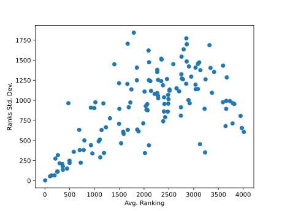
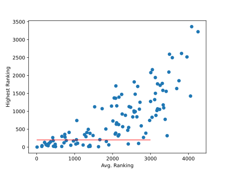
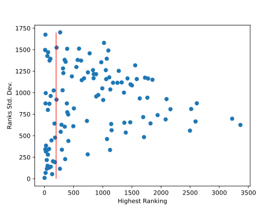
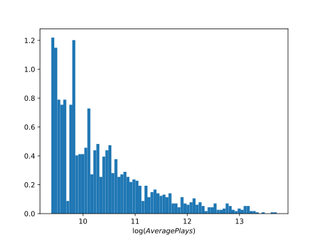

# 数据分析

## 结论 1：优质作者能获得稳定的流量

由爬取视频的顺序，我们可以对所爬取的视频进行排序，排序越前，视频播放量越高。

分别计算每个作者的排名均值和所有排名的标准差：

```python
data[author]["avg_rank"] = np.mean(data[author]["ranks"])
data[author]["ranks_stddev"] = np.std(data[author]["ranks"])
```

然后，剔除上榜视频数量小于 5 的作者：

```python
x = [data[author]["avg_rank"] for author in data if data[author]["ranks"].size > 4]
y = [data[author]["ranks_stddev"] for author in data if data[author]["ranks"].size > 4]
```

作得 `平均排名 - 排名标准差` 散点图如下：



我们认为，对于上榜视频达到一定数量的作者，其视频排名的平均值可以代表作者的平均水平。

由上图可以得到，水平越高（平均排名越高）的作者，其视频排名标准差，即排名波动越小；而水平稍差的作者，作品受欢迎程度波动明显较大。这表明，对于顶尖的视频创作者，其流量是十分稳定、有保障的。

## 结论 2：「顶流」并未被垄断

在前面计算的基础上，新增一项 `所有上榜视频的最高排名`：

```python
data[author]["highest_rank"] = np.min(data[author]["ranks"])
```

剔除上榜视频数量小于 5 的作者，并作 `平均排名 - 最高排名` 散点图如下：



另外，作 `最高排名 - 排名标准差` 散点图如下：



将播放排名的前 200 名认为是「播放量非常高」。从图 1 中可以看出，在红线（最高排名 200）以下的用户中，在平均排名 0～3000都有分布，且较为平均。从图 2 中可以看出，在红线以内的用户中，其视频排名的标准差分布范围极大。

这表明，虽然顶尖的作者基本上都能保持非常高的播放量，但一些并没有一直那么突出的用户，也有凭借一两部佳作冲击排名前列，收获顶级流量的可能。

## 结论3：不同作者流量的差距仍然巨大

作用户平均播放量（对数）的分布直方图如下：

```python
plays = [np.log(data[author]["avg_plays"])
         for author in data if data[author]["avg_plays"] < 1e6]

pyplot.hist(plays, density=True, bins=75)
```



可见，只有少数用户的播放量达到较高水平，绝大多数用户即使能够上榜，收获不少的播放量，但是和最高播放量的用户相比仍然差距巨大。可见，没有稳定的输出，很难在视频网站上达到顶尖水平，也很难获得持续的高流量。